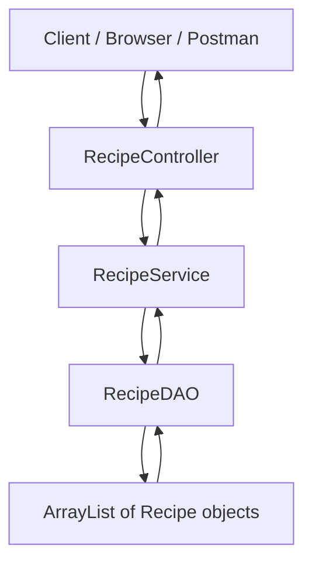
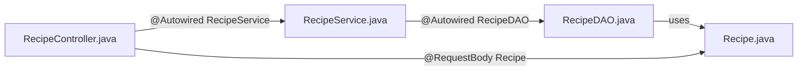
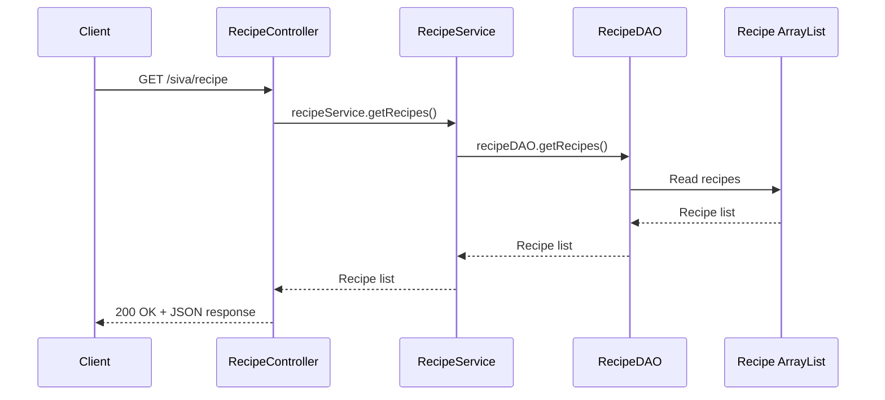
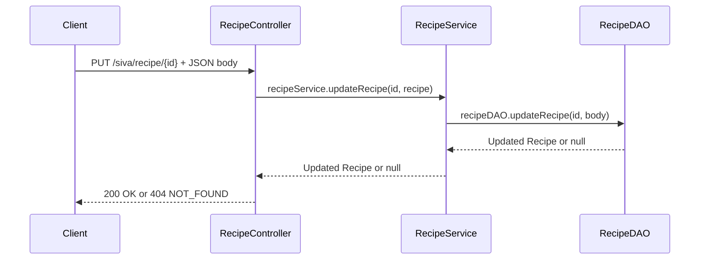

<br>
<hr>
<br>
<hr>

### Day 1 : Learns How To Intiate And Run Project , Designing Basic Routes And Design Methods With and Without Status Codes 

**Run command : <i><b> ./mvnw spring-boot:run  </b></i>**
<hr>
<br>
<hr>
<br>

### Day2 : Completed How To Return Status Codes , Object Of Arrays and Array of Objects Under The Files
 <li><ul>Product.java</ul><ul> Department.java</ul><ul> Courses.java</ul>

<hr>
<br>
<hr>
<br>

### Day3 : Mastered Datastructures Over Real world Data In the Format of Json And Based On Comparision Nested Datastructures Created And Implemented CRUD operative Methods

 **src : Recipe.java ; Reference:https://dummyjson.com/recipes**

<hr>
<br>
<hr>
<br>

 ## Day4 : Changing Default Port 
 #### check Out `application.properties` 
 ###### To Write An Route Active Check Log In Constructor Write Log AT the Time Of Object creation it prints the Log  
 
 <hr>
<br>
<hr>
<br>

 ## Day 5

 DAY 5 : Nothing progress from me ~ Sivanagu

 Day5 : Learned about the CSR which refers to Controllers,Service,Repository  as the spring follows 
 Browser  ->  Controller  ->  Service  -> Repository   , in which repository is always interface which defines rules , service contains main logic at which it provides service by considering data from the repository , controller just transfers the request to service and shows the o/p This separation of responsibilities makes the application clean, organized, easy to understand, and easier to maintain as the project grows.   
 ` This progress is from bhargav on day-5 where siva worked on the Web Scraping and successful `
<hr>
<br>
<hr>
<br>

## Day 6: Understanding Flow Between MVC Folders

Day 6 focused on understanding how files inside `SivasFolderMVC` talk to each other in a Spring Boot REST API.

### Folder Structure

```text
com.siva.restlearning.SivasFolderMVC
├── controller
│   └── RecipeController.java
├── service
│   └── RecipeService.java
├── dao
│   └── RecipeDAO.java
└── model
    └── Recipe.java
```

### Main Request Flow



### Layer Responsibilities

| Layer | File | Annotation | Main Responsibility | Should Not Handle |
|---|---|---|---|---|
| Controller | `RecipeController.java` | `@RestController` | Routes, request body, path variables, response status codes | Data storage logic |
| Service | `RecipeService.java` | `@Service` | Business logic, validations, calling DAO methods | HTTP routes/status codes |
| DAO | `RecipeDAO.java` | `@Repository` | Store, retrieve, update, and delete recipe data | API routes |
| Model | `Recipe.java` | Plain Java class | Defines recipe object structure | Business logic |

### File-To-File Connection



| From File | Calls / Uses | Purpose |
|---|---|---|
| `RecipeController.java` | `RecipeService` | Sends API work to the service layer |
| `RecipeService.java` | `RecipeDAO` | Sends data operations to the DAO layer |
| `RecipeDAO.java` | `Recipe` | Stores recipes inside `ArrayList<Recipe>` |
| `RecipeController.java` | `Recipe` | Converts incoming JSON into a Java object |

### API Endpoints In `RecipeController`

Base route:

```java
@RequestMapping("/siva/recipe")
```

| HTTP Method | Endpoint | Controller Method | Service Method | DAO Method | Success Status | Failure Status |
|---|---|---|---|---|---|---|
| `GET` | `/siva/recipe` | `getRecipes()` | `getRecipes()` | `getRecipes()` | `200 OK` | - |
| `POST` | `/siva/recipe` | `addRecipe(recipe)` | `addRecipe(recipe)` | `addRecipe(recipe)` | `201 CREATED` | - |
| `PUT` | `/siva/recipe/{id}` | `updateRecipe(id, recipe)` | `updateRecipe(id, recipe)` | `updateRecipe(id, body)` | `200 OK` | `404 NOT_FOUND` |
| `DELETE` | `/siva/recipe/{id}` | `deleteRecipe(id)` | `deleteRecipe(id)` | `deleteRecipe(id)` | `200 OK` | `404 NOT_FOUND` |

### Example: GET Request Flow



### Example: PUT Request Flow



### Why Model Is Important

Earlier data can be represented with generic structures like:

```java
LinkedHashMap<String, Object>
```

Now the project uses a proper model:

```java
Recipe
```

| Without Model | With Model |
|---|---|
| Data shape is unclear | Data shape is clear |
| More chances of key/name mistakes | Fields are defined in one class |
| Harder to maintain | Easier to read and update |
| Looks temporary | Looks professional |

### `Recipe` Model Fields

| Field | Type | Meaning |
|---|---|---|
| `id` | `int` | Unique recipe id |
| `name` | `String` | Recipe name |
| `price` | `double` | Recipe price |
| `steps` | `ArrayList<String>` | Steps to prepare the recipe |

### Important Annotations Learned

| Annotation | Used In | Meaning |
|---|---|---|
| `@RestController` | `RecipeController` | Marks class as REST API controller |
| `@RequestMapping` | `RecipeController` | Defines base route for all methods |
| `@GetMapping` | `RecipeController` | Handles GET requests |
| `@PostMapping` | `RecipeController` | Handles POST requests |
| `@PutMapping` | `RecipeController` | Handles PUT/update requests |
| `@DeleteMapping` | `RecipeController` | Handles DELETE requests |
| `@PathVariable` | Controller method parameter | Takes value from URL |
| `@RequestBody` | Controller method parameter | Converts JSON body into Java object |
| `@Autowired` | Controller and Service | Injects dependency automatically |
| `@Service` | `RecipeService` | Marks class as service/business layer |
| `@Repository` | `RecipeDAO` | Marks class as data access layer |

### Why `@Autowired` Works

Spring creates objects and injects them automatically.

Manual Java object creation:

```java
RecipeService rs = new RecipeService();
```

Spring dependency injection:

```java
@Autowired
RecipeService recipeService;
```

This keeps classes loosely connected and easier to maintain.

### Why Repository Folder Is Not Used Yet

The current project stores recipes in memory using:

```java
ArrayList<Recipe>
```

So there is no database repository yet. Later, when MySQL, Hibernate, or JPA is added, the repository layer can look like:

```java
RecipeRepository extends JpaRepository<Recipe, Integer>
```

### Day 6 Learnings

| Concept | Learned |
|---|---|
| REST API flow | Request moves from Controller to Service to DAO |
| MVC structure | Each folder has a separate responsibility |
| DAO | Handles in-memory data operations |
| Model | Creates a clean object structure |
| Dependency Injection | Spring injects objects using `@Autowired` |
| CRUD | GET, POST, PUT, DELETE operations are connected |
| Status codes | Controller decides success and failure responses |

This foundation makes JDBC, JPA, Hibernate, and database integration easier to understand next.

<hr>
<br>
<hr>
<br>

## Day 7: Practicing MVC Layer Archetecture Using Java DataStructures And Custom Data Objects Using model


`Progress From Siva Is Under SivasFolderMVC And Day 7 work Done Uisng Product`


<hr>
<br>
<hr>
<br>