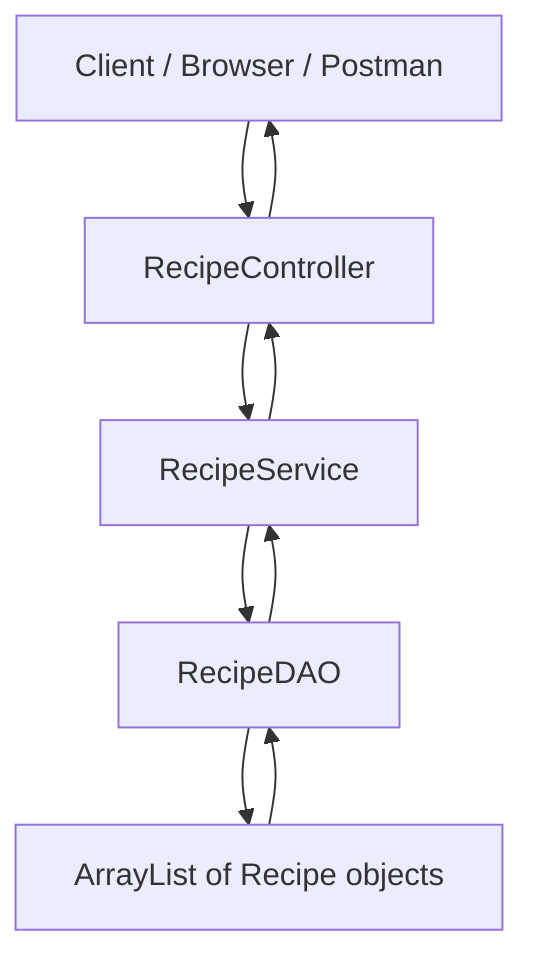
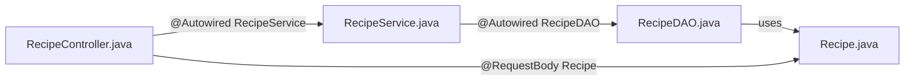
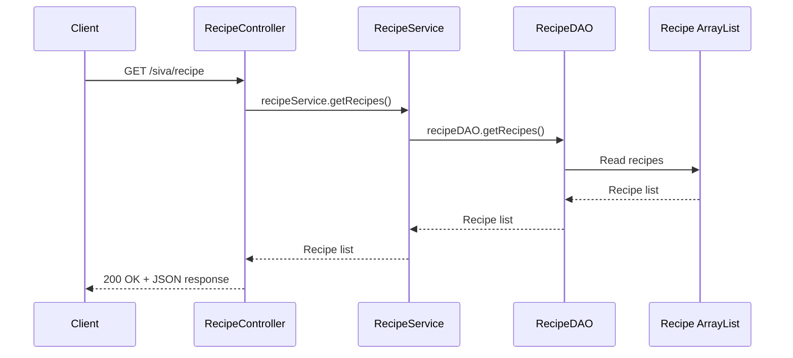
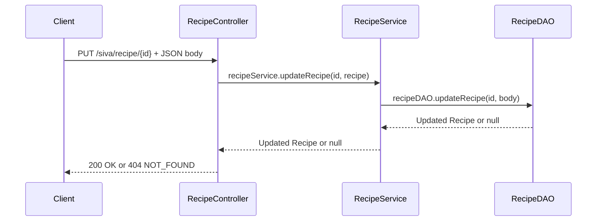

<br>
<hr>
<br>
<hr>

### Day 1 : Learns How To Intiate And Run Project , Designing Basic Routes And Design Methods With and Without Status Codes 

**Run command : <i><b> ./mvnw spring-boot:run  </b></i>**
<hr>
<br>
<hr>
<br>

### Day2 : Completed How To Return Status Codes , Object Of Arrays and Array of Objects Under The Files
 <li><ul>Product.java</ul><ul> Department.java</ul><ul> Courses.java</ul>

<hr>
<br>
<hr>
<br>

### Day3 : Mastered Datastructures Over Real world Data In the Format of Json And Based On Comparision Nested Datastructures Created And Implemented CRUD operative Methods

 **src : Recipe.java ; Reference:https://dummyjson.com/recipes**

<hr>
<br>
<hr>
<br>

 ## Day4 : Changing Default Port 
 #### check Out `application.properties` 
 ###### To Write An Route Active Check Log In Constructor Write Log AT the Time Of Object creation it prints the Log  
 
 <hr>
<br>
<hr>
<br>

 ## Day 5

 DAY 5 : Nothing progress from me ~ Sivanagu

 Day5 : Learned about the CSR which refers to Controllers,Service,Repository  as the spring follows 
 Browser  ->  Controller  ->  Service  -> Repository   , in which repository is always interface which defines rules , service contains main logic at which it provides service by considering data from the repository , controller just transfers the request to service and shows the o/p This separation of responsibilities makes the application clean, organized, easy to understand, and easier to maintain as the project grows.   
 ` This progress is from bhargav on day-5 where siva worked on the Web Scraping and successful `
<hr>
<br>
<hr>
<br>

## Day 6: Understanding Flow Between MVC Folders

Day 6 focused on understanding how files inside `SivasFolderMVC` talk to each other in a Spring Boot REST API.

### Folder Structure

```text
com.siva.restlearning.SivasFolderMVC
├── controller
│   └── RecipeController.java
├── service
│   └── RecipeService.java
├── dao
│   └── RecipeDAO.java
└── model
    └── Recipe.java
```

### Main Request Flow



### Layer Responsibilities

| Layer | File | Annotation | Main Responsibility | Should Not Handle |
|---|---|---|---|---|
| Controller | `RecipeController.java` | `@RestController` | Routes, request body, path variables, response status codes | Data storage logic |
| Service | `RecipeService.java` | `@Service` | Business logic, validations, calling DAO methods | HTTP routes/status codes |
| DAO | `RecipeDAO.java` | `@Repository` | Store, retrieve, update, and delete recipe data | API routes |
| Model | `Recipe.java` | Plain Java class | Defines recipe object structure | Business logic |

### File-To-File Connection



| From File | Calls / Uses | Purpose |
|---|---|---|
| `RecipeController.java` | `RecipeService` | Sends API work to the service layer |
| `RecipeService.java` | `RecipeDAO` | Sends data operations to the DAO layer |
| `RecipeDAO.java` | `Recipe` | Stores recipes inside `ArrayList<Recipe>` |
| `RecipeController.java` | `Recipe` | Converts incoming JSON into a Java object |

### API Endpoints In `RecipeController`

Base route:

```java
@RequestMapping("/siva/recipe")
```

| HTTP Method | Endpoint | Controller Method | Service Method | DAO Method | Success Status | Failure Status |
|---|---|---|---|---|---|---|
| `GET` | `/siva/recipe` | `getRecipes()` | `getRecipes()` | `getRecipes()` | `200 OK` | - |
| `POST` | `/siva/recipe` | `addRecipe(recipe)` | `addRecipe(recipe)` | `addRecipe(recipe)` | `201 CREATED` | - |
| `PUT` | `/siva/recipe/{id}` | `updateRecipe(id, recipe)` | `updateRecipe(id, recipe)` | `updateRecipe(id, body)` | `200 OK` | `404 NOT_FOUND` |
| `DELETE` | `/siva/recipe/{id}` | `deleteRecipe(id)` | `deleteRecipe(id)` | `deleteRecipe(id)` | `200 OK` | `404 NOT_FOUND` |

### Example: GET Request Flow



### Example: PUT Request Flow



### Why Model Is Important

Earlier data can be represented with generic structures like:

```java
LinkedHashMap<String, Object>
```

Now the project uses a proper model:

```java
Recipe
```

| Without Model | With Model |
|---|---|
| Data shape is unclear | Data shape is clear |
| More chances of key/name mistakes | Fields are defined in one class |
| Harder to maintain | Easier to read and update |
| Looks temporary | Looks professional |

### `Recipe` Model Fields

| Field | Type | Meaning |
|---|---|---|
| `id` | `int` | Unique recipe id |
| `name` | `String` | Recipe name |
| `price` | `double` | Recipe price |
| `steps` | `ArrayList<String>` | Steps to prepare the recipe |

### Important Annotations Learned

| Annotation | Used In | Meaning |
|---|---|---|
| `@RestController` | `RecipeController` | Marks class as REST API controller |
| `@RequestMapping` | `RecipeController` | Defines base route for all methods |
| `@GetMapping` | `RecipeController` | Handles GET requests |
| `@PostMapping` | `RecipeController` | Handles POST requests |
| `@PutMapping` | `RecipeController` | Handles PUT/update requests |
| `@DeleteMapping` | `RecipeController` | Handles DELETE requests |
| `@PathVariable` | Controller method parameter | Takes value from URL |
| `@RequestBody` | Controller method parameter | Converts JSON body into Java object |
| `@Autowired` | Controller and Service | Injects dependency automatically |
| `@Service` | `RecipeService` | Marks class as service/business layer |
| `@Repository` | `RecipeDAO` | Marks class as data access layer |

### Why `@Autowired` Works

Spring creates objects and injects them automatically.

Manual Java object creation:

```java
RecipeService rs = new RecipeService();
```

Spring dependency injection:

```java
@Autowired
RecipeService recipeService;
```

This keeps classes loosely connected and easier to maintain.

### Why Repository Folder Is Not Used Yet

The current project stores recipes in memory using:

```java
ArrayList<Recipe>
```

So there is no database repository yet. Later, when MySQL, Hibernate, or JPA is added, the repository layer can look like:

```java
RecipeRepository extends JpaRepository<Recipe, Integer>
```

### Day 6 Learnings

| Concept | Learned |
|---|---|
| REST API flow | Request moves from Controller to Service to DAO |
| MVC structure | Each folder has a separate responsibility |
| DAO | Handles in-memory data operations |
| Model | Creates a clean object structure |
| Dependency Injection | Spring injects objects using `@Autowired` |
| CRUD | GET, POST, PUT, DELETE operations are connected |
| Status codes | Controller decides success and failure responses |

This foundation makes JDBC, JPA, Hibernate, and database integration easier to understand next.

<hr>
<br>
<hr>
<br>

## Day 7: Practicing MVC Layer Archetecture Using Java DataStructures And Custom Data Objects Using model


`Progress From Siva Is Under SivasFolderMVC And Day 7 work Done Uisng Product`


<hr>
<br>
<hr>
<br>

## Day 8: Managing Environment Variables and Creating Tables in DB with JPA/Hibernate

---

<details>
<summary><strong>1. Class Level Annotations</strong></summary>

<br>

### `@Entity`

Marks a class as a database table.

```java
@Entity
```

---

### `@Table`

Defines the table name, schema, and constraints.

```java
@Table(
    name = "products",
    schema = "shop",
    uniqueConstraints = {
        @UniqueConstraint(columnNames = {"email"})
    }
)
```

| Property            | Purpose                   |
| ------------------- | ------------------------- |
| `name`              | Table name in DB          |
| `schema`            | Schema to use             |
| `catalog`           | Catalog to use            |
| `uniqueConstraints` | Define unique constraints |

</details>

---

<details>
<summary><strong>2. Primary Key Annotations</strong></summary>

<br>

### `@Id`

Marks the field as the primary key.

```java
@Id
```

### `@GeneratedValue`

Defines the primary key generation strategy.

```java
@GeneratedValue(strategy = GenerationType.IDENTITY)
```

| Strategy   | Meaning                              |
| ---------- | ------------------------------------ |
| `IDENTITY` | Auto-increment by DB (MySQL default) |
| `AUTO`     | JPA picks the strategy               |
| `SEQUENCE` | DB sequence object                   |
| `TABLE`    | Uses a separate table for keys       |

</details>

---

<details>
<summary><strong>3. Column Properties</strong></summary>

<br>

```java
@Column(
    name = "product_name",
    nullable = false,
    unique = true,
    length = 100,
    insertable = true,
    updatable = true,
    precision = 10,
    scale = 2,
    columnDefinition = "VARCHAR(100) DEFAULT 'Unknown'"
)
```

| Property           | Purpose                    |
| ------------------ | -------------------------- |
| `name`             | DB column name             |
| `nullable`         | NOT NULL constraint        |
| `unique`           | UNIQUE constraint          |
| `length`           | VARCHAR size               |
| `precision`        | Total digits (for doubles) |
| `scale`            | Decimal digits             |
| `insertable`       | Allow insert               |
| `updatable`        | Allow update               |
| `columnDefinition` | Custom SQL definition      |

</details>

---

<details>
<summary><strong>4. Relationships / Foreign Keys</strong></summary>

<br>

<details>
<summary>&nbsp;&nbsp;&nbsp;&nbsp;4a. One To One</summary>

<br>

```java
@OneToOne(
    cascade = CascadeType.ALL,
    fetch = FetchType.LAZY,
    optional = false
)
@JoinColumn(
    name = "user_id",
    referencedColumnName = "id",
    nullable = false,
    unique = true
)
User user;
```

**`@OneToOne` Properties:** `cascade`, `fetch`, `optional`, `mappedBy`

**`@JoinColumn` Properties:** `name`, `referencedColumnName`, `nullable`, `unique`, `foreignKey`

</details>

<details>
<summary>&nbsp;&nbsp;&nbsp;&nbsp;4b. Many To One (most common)</summary>

<br>

```java
@ManyToOne(fetch = FetchType.LAZY)
@JoinColumn(
    name = "category_id",
    nullable = false,
    foreignKey = @ForeignKey(name = "fk_product_category")
)
Category category;
```

Generates:

```sql
FOREIGN KEY (category_id) REFERENCES categories(id)
```

</details>

<details>
<summary>&nbsp;&nbsp;&nbsp;&nbsp;4c. One To Many</summary>

<br>

```java
@OneToMany(mappedBy = "category")
List<Product> products;
```

**Properties:** `mappedBy`, `cascade`, `fetch`, `orphanRemoval`

</details>

<details>
<summary>&nbsp;&nbsp;&nbsp;&nbsp;4d. Many To Many</summary>

<br>

```java
@ManyToMany
@JoinTable(
    name = "student_courses",
    joinColumns = @JoinColumn(name = "student_id"),
    inverseJoinColumns = @JoinColumn(name = "course_id")
)
List<Course> courses;
```

Creates an automatic **junction table** in the database.

</details>

</details>

---

<details>
<summary><strong>5. Cascade and Fetch Types</strong></summary>

<br>

### Cascade Types

```java
cascade = CascadeType.ALL
```

| Type      | Meaning                              |
| --------- | ------------------------------------ |
| `ALL`     | Apply all cascades                   |
| `PERSIST` | Save child when parent is saved      |
| `MERGE`   | Merge child when parent is merged    |
| `REMOVE`  | Delete child when parent is deleted  |
| `REFRESH` | Refresh child when parent is refreshed |
| `DETACH`  | Detach child when parent is detached |

### Fetch Types

```java
fetch = FetchType.LAZY
```

| Type    | Meaning                         |
| ------- | ------------------------------- |
| `LAZY`  | Load related data only when accessed |
| `EAGER` | Load related data immediately   |

</details>

---

<details>
<summary><strong>6. Constraints</strong></summary>

<br>

### Check Constraint

```java
@Check(constraints = "price > 0")
```

### Unique Constraint

```java
@Table(
    uniqueConstraints = {
        @UniqueConstraint(columnNames = {"email"})
    }
)
```

</details>

---

<details>
<summary><strong>7. Indexes</strong></summary>

<br>

```java
@Table(
    indexes = {
        @Index(name = "idx_product_name", columnList = "product_name")
    }
)
```

</details>

---

<details>
<summary><strong>8. Special Field Annotations</strong></summary>

<br>

### Enum

```java
@Enumerated(EnumType.STRING)
Role role;
```

### Date & Time (Legacy)

```java
@Temporal(TemporalType.DATE)
Date createdAt;
```

> **Modern preferred:** Use `LocalDate` or `LocalDateTime` directly — no annotation needed.

### Auto Timestamps (Hibernate)

```java
@CreationTimestamp
LocalDateTime createdAt;

@UpdateTimestamp
LocalDateTime updatedAt;
```

### Transient (Not Stored in DB)

```java
@Transient
String tempData;
```

### Large Data (LOB)

```java
@Lob
String description;
```

### Embedded Objects

```java
@Embeddable
class Address { ... }

// In the parent entity:
@Embedded
Address address;
```

</details>

---

<details>
<summary><strong>9. Complete Real Entity Example</strong></summary>

<br>

```java
@Entity
@Table(
    name = "products",
    indexes = {
        @Index(name = "idx_name", columnList = "product_name")
    },
    uniqueConstraints = {
        @UniqueConstraint(columnNames = {"product_name"})
    }
)
@Check(constraints = "price > 0")
public class Product {

    @Id
    @GeneratedValue(strategy = GenerationType.IDENTITY)
    Long id;

    @Column(
        name = "product_name",
        nullable = false,
        unique = true,
        length = 100
    )
    String name;

    @Column(
        nullable = false,
        precision = 10,
        scale = 2,
        columnDefinition = "DOUBLE DEFAULT 1.0"
    )
    Double price;

    @CreationTimestamp
    LocalDateTime createdAt;

    @ManyToOne(fetch = FetchType.LAZY)
    @JoinColumn(
        name = "category_id",
        nullable = false,
        foreignKey = @ForeignKey(name = "fk_product_category")
    )
    Category category;
}
```

</details>

---

<details>
<summary><strong>10. DDL Auto Property (application.properties)</strong></summary>

<br>

```properties
spring.jpa.hibernate.ddl-auto=update
```

| Value         | Behaviour                                 |
| ------------- | ----------------------------------------- |
| `create`      | Drops and recreates tables on every start |
| `create-drop` | Creates on start, drops on shutdown       |
| `update`      | Updates schema without dropping data      |
| `validate`    | Validates schema, makes no changes        |
| `none`        | Does nothing                              |

**For development:** `update`

**For a fresh DB recreation:** `create`

> Hibernate can generate nearly complete production-level tables directly from Java entities if configured properly.

</details>

## Day 9: First Real Database Connection — JPA Repository, Custom Queries, and Derived Methods

---

<details>
<summary><strong>1. What Was Built</strong></summary>

<br>

Day 9 was the first time the project connected to a real database instead of storing data in memory with an `ArrayList`.

A `Mobile` entity was created and mapped to a MySQL table called `mobile_information`. Full CRUD-style API endpoints were wired through the MVC layers — Controller → Service → Repository — all the way to the actual database.

### Folder Structure

```text
com.siva.restlearning.SivasFolderMVC.DBConnection
├── controller
│   └── MobileController.java
├── service
│   └── MobileService.java
├── repository
│   └── MobileRepository.java
└── model
    └── Mobile.java
```

</details>

---

<details>
<summary><strong>2. The Model — Mobile.java</strong></summary>

<br>

```java
@Data
@Entity
@Table(name = "mobile_information")
public class Mobile {

    @Id
    @GeneratedValue(strategy = GenerationType.IDENTITY)
    private Long id;

    private String brand;
    private String model;
    private double price;
}
```

### Annotations Used

| Annotation | Purpose |
|---|---|
| `@Entity` | Marks this class as a JPA entity / DB table |
| `@Table(name = "mobile_information")` | Maps the class to the `mobile_information` table |
| `@Id` | Marks `id` as the primary key |
| `@GeneratedValue(strategy = GenerationType.IDENTITY)` | Auto-increments the `id` using DB identity column |
| `@Data` | Lombok — auto-generates getters, setters, `toString`, `equals`, `hashCode` |

### Why `@Data` (Lombok)?

Without Lombok, every field needs manually written getters and setters. `@Data` removes that boilerplate completely.

```java
// Without Lombok — manual boilerplate
public String getBrand() { return brand; }
public void setBrand(String brand) { this.brand = brand; }
// ... repeated for every field

// With Lombok — one annotation does it all
@Data
public class Mobile { ... }
```

</details>

---

<details>
<summary><strong>3. The Repository — MobileRepository.java</strong></summary>

<br>

```java
public interface MobileRepository extends JpaRepository<Mobile, Long> {

    @Query(value = "SELECT * FROM mobile_information", nativeQuery = true)
    List<Mobile> getAllData();

    List<Mobile> findByBrand(String brand);
}
```

This is the most important new concept of Day 9.

### What is `JpaRepository`?

`MobileRepository` does not extend a class — it extends an **interface**: `JpaRepository<Mobile, Long>`.

| Part | Meaning |
|---|---|
| `JpaRepository` | Spring Data JPA interface with built-in DB methods |
| `Mobile` | The entity this repository manages |
| `Long` | The type of the primary key (`id` field) |

By extending `JpaRepository`, the repository **automatically gets** these methods for free — no implementation needed:

| Built-in Method | What It Does |
|---|---|
| `save(entity)` | Insert or update a record |
| `findById(id)` | Find one record by primary key |
| `findAll()` | Get all records |
| `deleteById(id)` | Delete a record by primary key |
| `count()` | Count total records |
| `existsById(id)` | Check if a record exists |

---

### Custom Query — `@Query` with `nativeQuery`

```java
@Query(value = "SELECT * FROM mobile_information", nativeQuery = true)
List<Mobile> getAllData();
```

| Part | Meaning |
|---|---|
| `@Query` | Lets you write a custom SQL or JPQL query |
| `value = "SELECT * FROM mobile_information"` | Raw SQL to execute |
| `nativeQuery = true` | Tells Spring to run this as native SQL, not JPQL |

**Why use `@Query` here instead of `findAll()`?**

`findAll()` already does the same thing. Using `@Query` here was done intentionally to **learn and practice** writing custom native queries. In real projects, `@Query` is used when the query is too complex for a derived method.

---

### Derived Method — `findByBrand`

```java
List<Mobile> findByBrand(String brand);
```

This method has **no `@Query` annotation and no implementation** — Spring Data JPA automatically generates the SQL from the method name.

| Method Name | Generated SQL |
|---|---|
| `findByBrand(String brand)` | `SELECT * FROM mobile_information WHERE brand = ?` |
| `findByPrice(double price)` | `SELECT * FROM mobile_information WHERE price = ?` |
| `findByBrandAndModel(String brand, String model)` | `SELECT * FROM ... WHERE brand = ? AND model = ?` |

**Rules for derived method names:**

- Must start with `findBy`
- Field name must match exactly (case-sensitive after `findBy`)
- Multiple conditions: `findByBrandAndModel`, `findByBrandOrModel`
- No SQL needed — Spring reads the method name and writes the query automatically

</details>

---

<details>
<summary><strong>4. The Service — MobileService.java</strong></summary>

<br>

```java
@Service
public class MobileService {

    @Autowired
    MobileRepository mobileRepository;

    public List<Mobile> getAllMobiles() {
        return mobileRepository.getAllData();
    }

    public HashMap<String, Object> addMobile(@NonNull Mobile mobile) {
        mobileRepository.save(mobile);
        HashMap<String, Object> response = new HashMap<>();
        response.put("message", "Mobile added successfully");
        response.put("mobile", mobile);
        return response;
    }

    public List<Mobile> getMobilesByBrand(String brand) {
        return mobileRepository.findByBrand(brand);
    }
}
```

### What the Service Does

| Method | Calls | Returns |
|---|---|---|
| `getAllMobiles()` | `mobileRepository.getAllData()` | All mobiles from DB |
| `addMobile(mobile)` | `mobileRepository.save(mobile)` | Custom response `HashMap` |
| `getMobilesByBrand(brand)` | `mobileRepository.findByBrand(brand)` | Filtered list by brand |

### Custom Response with `HashMap`

Instead of returning just the saved object, `addMobile` wraps the result in a `HashMap`:

```java
HashMap<String, Object> response = new HashMap<>();
response.put("message", "Mobile added successfully");
response.put("mobile", mobile);
return response;
```

This produces a JSON response like:

```json
{
  "message": "Mobile added successfully",
  "mobile": {
    "id": 1,
    "brand": "Samsung",
    "model": "Galaxy S24",
    "price": 79999.0
  }
}
```

This pattern is useful for sending extra metadata alongside the saved data.

</details>

---

<details>
<summary><strong>5. The Controller — MobileController.java</strong></summary>

<br>

```java
@RestController
@RequestMapping("/api/mobiles")
public class MobileController {

    @Autowired
    MobileService mobileService;

    @GetMapping
    public List<Mobile> getAllMobiles() {
        return mobileService.getAllMobiles();
    }

    @GetMapping("/{brand}")
    public List<Mobile> getMobilesByBrand(@PathVariable String brand) {
        return mobileService.getMobilesByBrand(brand);
    }

    @PostMapping
    public HashMap<String, Object> addMobile(@RequestBody @NonNull Mobile mobile) {
        return mobileService.addMobile(mobile);
    }
}
```

### API Endpoints

| HTTP Method | Endpoint | Description | Returns |
|---|---|---|---|
| `GET` | `/api/mobiles` | Get all mobiles | `List<Mobile>` |
| `GET` | `/api/mobiles/{brand}` | Get mobiles by brand | `List<Mobile>` |
| `POST` | `/api/mobiles` | Add a new mobile | `HashMap` with message + mobile |

### `@NonNull` on `@RequestBody`

```java
public HashMap<String, Object> addMobile(@RequestBody @NonNull Mobile mobile)
```

`@NonNull` (from `org.springframework.lang`) tells Spring to reject the request early if the body is null, preventing null pointer errors deeper in the service or repository layer.

</details>

---

<details>
<summary><strong>6. Full Request Flow</strong></summary>

<br>

### GET All Mobiles

```
Client
  → GET /api/mobiles
  → MobileController.getAllMobiles()
  → MobileService.getAllMobiles()
  → MobileRepository.getAllData()   ← @Query native SQL
  → MySQL DB
  → List<Mobile>
  → 200 OK + JSON array
```

### GET By Brand

```
Client
  → GET /api/mobiles/Samsung
  → MobileController.getMobilesByBrand("Samsung")
  → MobileService.getMobilesByBrand("Samsung")
  → MobileRepository.findByBrand("Samsung")   ← derived method
  → MySQL DB: SELECT * WHERE brand = 'Samsung'
  → List<Mobile>
  → 200 OK + JSON array
```

### POST Add Mobile

```
Client
  → POST /api/mobiles + JSON body
  → MobileController.addMobile(mobile)
  → MobileService.addMobile(mobile)
  → MobileRepository.save(mobile)   ← built-in JpaRepository method
  → MySQL DB: INSERT INTO mobile_information
  → HashMap { message, mobile }
  → 200 OK + JSON response
```

</details>

---

<details>
<summary><strong>7. In-Memory vs Database — Key Difference</strong></summary>

<br>

| Feature | Days 1–7 (In-Memory) | Day 9 (Database) |
|---|---|---|
| Storage | `ArrayList<Recipe>` in Java | MySQL table `mobile_information` |
| Data persists after restart | No — lost on every restart | Yes — stored permanently |
| Repository type | Custom `RecipeDAO.java` class | Interface extending `JpaRepository` |
| Queries | Manual Java loops | SQL generated by JPA / `@Query` |
| Save method | `list.add(object)` | `repository.save(object)` |
| Find by field | Manual `for` loop with `if` | `findByBrand(brand)` derived method |

</details>

---

<details>
<summary><strong>8. Key Concepts Summary</strong></summary>

<br>

| Concept | What Was Learned |
|---|---|
| `JpaRepository` | Extends interface to get built-in DB operations |
| `@Query` with `nativeQuery = true` | Write raw SQL inside the repository interface |
| Derived methods (`findByBrand`) | Spring auto-generates SQL from the method name |
| `@Data` (Lombok) | Removes getter/setter boilerplate from model |
| `repository.save(entity)` | Inserts or updates a record in the DB |
| `HashMap` response | Return custom JSON with extra fields alongside the entity |
| `@NonNull` on `@RequestBody` | Rejects null request bodies early |
| Real DB connection | First time data is stored in MySQL, not in memory |

</details>


